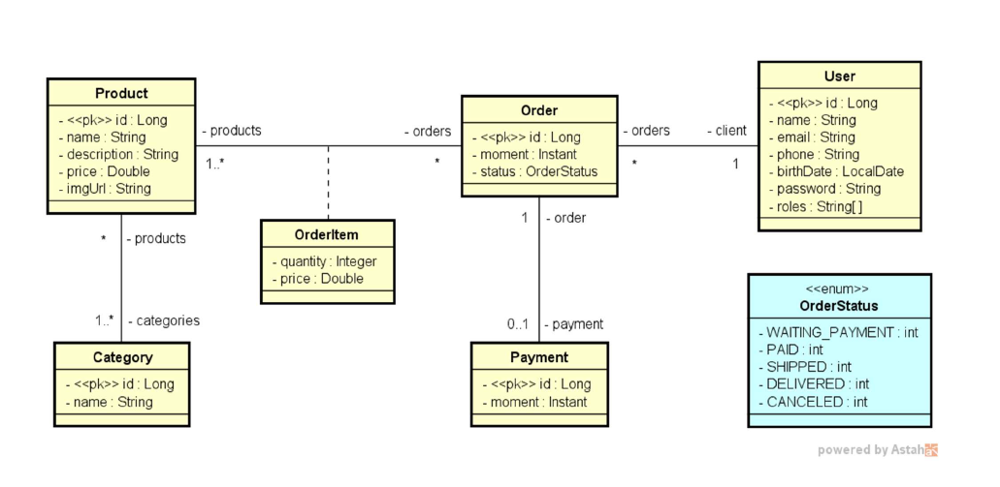

### Visão Geral do Projeto

Formação Desenvolvedor Moderno Módulo: Front end

Nesse projeto vamos aprender a:

1. Layout HTML/CSS
2. Componentes, Rotas, Props
3. Hooks useState, useEffect, requisições
4. Local Storage e lógica de carrinho de compras
5. Autenticação e controle de acesso
6. Comunicação entre componentes, eventos, Context API
7. Formulários, CRUD completo
8. Implantação CI/CD em plataforma

### Premissas 

Deseja-se fazer um sistema para ser utilizado em cursos da Devsuperior no processo de
aprendizado dos alunos. Para isto, a concepção do sistema partiu das seguintes
premissas:

1. Deve ser um sistema que possua um modelo de domínio relativamente simples,
porém abrangente, ou seja, que explore vários tipos de relacionamentos entre as
entidades de negócio (muitos-para-um, muitos-para-muitos, etc.).

2. O sistema deve possibilitar a aplicação de vários conhecimentos importantes das
disciplinas de fundamentos.

3. O sistema deve conter as principais funcionalidades que se espera de um
profissional iniciante deve saber construir, tais como telas de cadastro e fluxos de
caso de uso.

### Visão Geral do Sistema 

O sistema deve manter um cadastro de usuário, produtos e suas categorias. Cada
usuário possui nome, email, telefone, data de nascimento e uma senha de acesso. Os
dados dos produtos são: nome, descrição, preço e imagem. O sistema deve apresentar
um catálogo de produtos, os quais podem ser filtrados pelo nome do produto. A partir
desse catálogo, o usuário pode selecionar um produto para ver seus detalhes e para
decidir se o adiciona a um carrinho de compras. O usuário pode incluir e remover itens
do carrinho de compra, bem como alterar as quantidades de cada item. Uma vez que o
usuário decida encerrar o pedido, o pedido deve então ser salvo no sistema com o status
de "aguardando pagamento". Os dados de um pedido são: instante em que ele foi salvo,
status, e uma lista de itens, onde cada item se refere a um produto e sua quantidade no
pedido. O status de um pedido pode ser: aguardando pagamento, pago, enviado,
entregue e cancelado. Quando o usuário paga por um pedido, o instante do pagamento
deve ser registrado. Os usuários do sistema podem ser clientes ou administradores,
sendo que todo usuário cadastrado por padrão é cliente. Usuários não identificados
podem se cadastrar no sistema, navegar no catálogo de produtos e no carrinho de
compras. Clientes podem atualizar seu cadastro no sistema, registrar pedidos e visualizar
seus próprios pedidos. Usuários administradores tem acesso à área administrativa onde
pode acessar os cadastros de usuários, produtos e categorias.

### Protótipo de tela

<a href="https://www.figma.com/design/ZrGNVNG0kZL6txDv4G8P6s/DSCommerce?node-id=0-1&t=lgc6ue91U5LVgWjl-0">DSCmmerce</a>

### Modelo Conceitual

Este é o modelo conceitual do sistema DSCommerce. Considerações:
 Cada item de pedido (OrderItem) corresponde a um produto no pedido, com uma
quantidade. Sendo que o preço também é armazenado no item de pedido por
questões de histórico (se o preço do produto mudar no futuro, o preço do item de
pedido continua registrado com o preço real que foi vendido na época).
 Um usuário pode ter um ou mais "roles", que são os perfis de acesso deste usuário
no sistema (client, admin).

### Caso de uso (Visão Geral)

| Caso de uso         | Visão Geral                                          | Acesso        |
| --------------------|------------------------------------------------------|---------------|
|Manter produtos      |CRUD de produtos, podendo filtrar itens pelo nome     |Somente Admin  |
|Manter categorias    |CRUD de categorias, podendo filtrar itens pelo nome   |Somente Admin  |
|Manter usuários      |CRUD de usuários, podendo filtrar itens pelo nome     |Somente Admin  |
|Gerenciar caminhos   |Incluir e remover itens do carrinho de compras, bem   |Somente Admin  |
|                      como alterar as quantidades do produto em cada item                
|Consultar catálogo   |Listar produtos disponíveis, podendo filtrar produtos |Público        |
|                     | pelo nome                                            |               |
| Sign Up             |Cadastrar-se no sistema                               |Público        |
| Login               |Efetuar login no sistema                              |Público        |
| Registrar Pedidos   |Salvar no sistema um pedido a partir dos dados do     |               |
|                     | carrinho de compras informado                        |PUsuário logado|
| Atualizar Perfil    |Visualizar os pedidos que o próprio usuário já fez    |Público        |
| Registrar Pagamentos|Salvar no sistema os dados do pagamento de um         |               |
|                     | pedido                                               |Público        |
| Reportar pedidos    |Relatório de pedidos, podendo ser filtrados por data  |Público        |

### Atores 

| Atores         | Responsabilidades                                                         |      
|----------------|---------------------------------------------------------------------------|
|Usuário anônimo |Pode realizar casos de uso das áreas públicas do sistema, como catálogo,   |
|                |carrinho de compras, login e sign up.                                      |
|Cliente         |Responsável por manter seu próprios dados pessoais no sistema,e pode       |
|                |visualizar histórico dos seus pedidos. Todo usuário cadastrado por padrão  | 
|                |é um Cliente.                                                              |
|Admin           |Responsável por acessar a área administrativa do sistema com cadastros e   | 
|                |relatórios. Admin também pode fazer tudo que                               |
|                |Cliente faz.                                                               | 